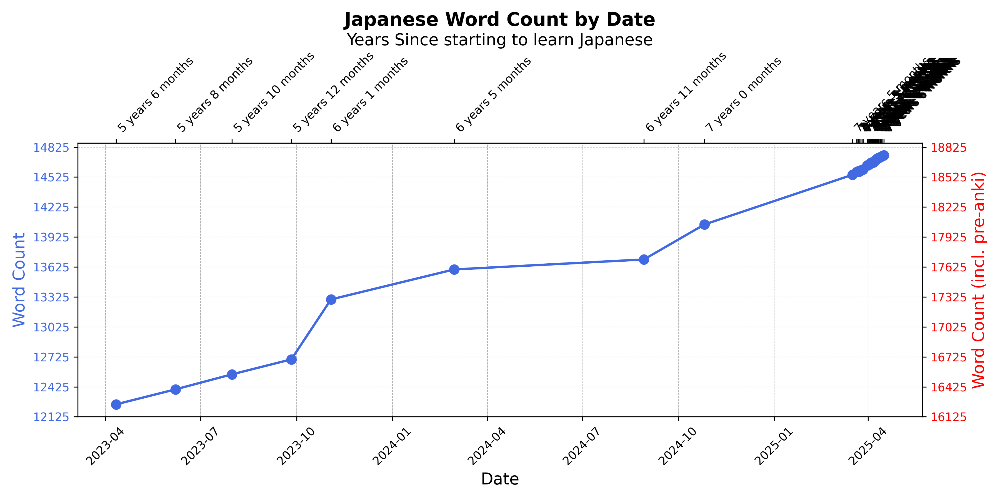

I am a Mexican-British medical doctor and aspiring software engineer. I have recently decided to try competitive programming seriously and do my best to improve my rating! To this end, I have included an AtCoder solved problem and rating tracker below for a bit of public accountability! These update daily together with my anki vocab counts for the languages I am currently learning.

🌠[My Atcoder Account](https://atcoder.jp/users/isym444):  👨‍💻 [My Codeforces Account](https://codeforces.com/profile/isym444): 

 <h3>👨‍💻 Programming and Markup Languages</h3>
  

      
      
      
      
      
      
      
  

  <h3>🧰 Frameworks and Libraries</h3>

  

      
      
      <a href="#"></a

  

  <h3>🗄️ Databases and Cloud Hosting</h3>

  

      
      
      
  

  <h3>💻 Software and Tools</h3>

  

      
      
      
      
      
      
      
      
      
      
      <!--  -->
      
  

<!--  
 -->
 
 
<table>
<tr>
<td width="30%" valign="top">

**AtCoder Problems Solved:** 486

**AtCoder Rating:** 665

**Codeforces Problems Solved since Jan 2024:** 30

**Codeforces Rating:** 1228

**USACO division:** Silver  

**JLPT passed:** N2

**Japanese words:** 17723

**Portuguese words:** 627

</td>
<td>

